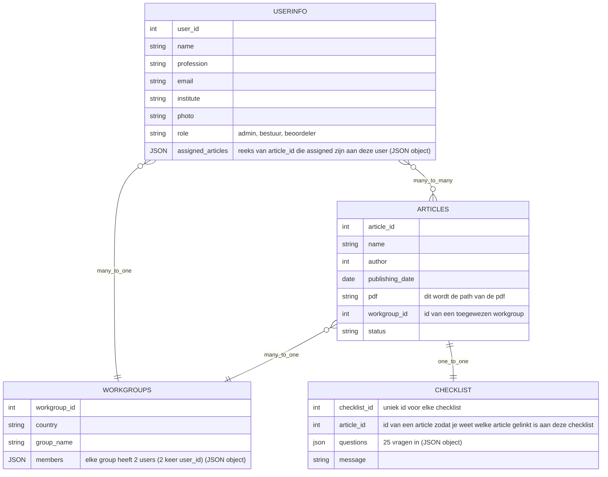

# FootGuard

## Datamodel

# 🖥️ Installatie

**Fork de repository**
Ga naar de [repository pagina](https://github.com/fdnd-agency/footguard) en klik op de Fork knop in de rechterbovenhoek om een kopie van de repository naar je eigen GitHub account te maken.

**Clone de repository**
Clone je geforkte repository naar je lokale computer door het volgende command uit te voeren in de terminal: git clone https://github.com/fdnd-agency/footguard.git

**Navigeer naar folder**
Heb je de repo in een nieuwe folder geforkt? Navigeer dan eerst naar die folder via de terminal: 'cd foldernaam'. Anders kan je deze stap overslaan.

**Installeer de packages**
Voer in de terminal de command npm install uit om de packages uit de package.JSON te installeren.

**Start de server**
Voer in de terminal de command 'npm run dev' of 'npm run dev -- --open' om het venster automatischc te openen.
