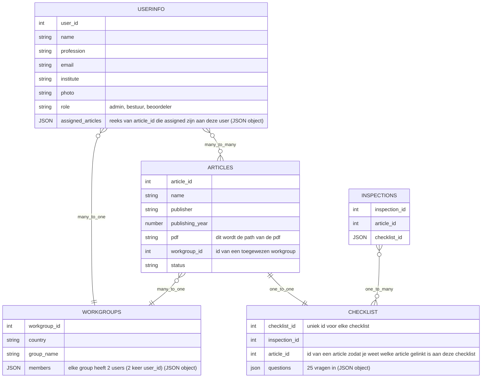

# 📖 FootGuard

De International Working Group on the Diabetic Foot (IWGDF) is een wereldwijd
samenwerkingsverband van specialisten die richtlijnen ontwikkelt voor de preventie en
behandeling van diabetische voetproblemen. Deze richtlijnen worden internationaal
gebruikt door artsen, verpleegkundigen en onderzoekers om de zorg voor patiënten met
diabetesvoet te verbeteren.

- Livelink(TBD)

# 🔍 Opdrachtomschrijving

De huidige website is verouderd en het beoordelen van onderzoeken gebeurt nu nog op
een ineIiciënte manier, onder andere met Excel. Dit proces kan veel beter en makkelijker.
Wij hebben de opdracht gekregen om een nieuwe website te ontwikkelen waarin dit
onderzoeksproces geïntegreerd wordt. In deze website worden verschillende
functionaliteiten toegevoegd om het beoordelen overzichtelijker, gebruiksvriendelijker
en eficiënter te maken.

# 🪾 Branches
- [Dev branche](https://github.com/fdnd-agency/footguard/tree/dev-main)
- [Main branche](https://github.com/fdnd-agency/footguard/tree/main)

# 📊 Datamodel

# 🎨 Ontwerp en design

Bij het ontwerpen van deze tool zijn de volgende ontwerpkeuzen gemaakt.

- **Kleurenpallet:**  
De primaire kleuren van de tool zijn afgeleid van het logo. Vanuit deze kleuren zijn meerdere iteraties gemaakt, wat uiteindelijk heeft geleid tot het definitieve kleurenpalet.

- **Typografie:**  
Voor de typografie is gekozen voor DM Sans vanwege de moderne en goed leesbare stijl. Als fallback wordt de font sans-serif gebruikt.

- **Navigatie:**  
De tool functioneert als een dashboard. De navigatie bevindt zich in een sidebar aan de linkerkant van het scherm. Op kleinere schermen wordt deze sidebar inklapbaar om ruimte te besparen en de gebruikservaring te verbeteren.

- **Hi-fi designs:**  
De hi-fi designs laten zien hoe de uiteindelijke schermen eruitzien. Daarnaast visualiseert het UML-diagram de gebruikersflow en de structuur van de verschillende pagina’s.

De kleurenpallet, huisstijl, UML-diagrammen, schetsen en hi-fi designs zijn te vinden in het [Figma-bestand](https://www.figma.com/design/FcenWarr4zCNYt1xSufqHv/Sprint-14-Footguard?node-id=16-2&p=f).

# 📱 Pagina's
Deze sprint was voornamelijk begrip krijgen van de opdracht en dit vertalen naar een ontwerp/design. Wel hebben we alvast een aantal onderdelen van de pagina's gemaakt. 

### Dashboard
De dashboardpagina is de homepagina van de gebruiker na het inloggen. Hier ziet de gebruiker in één keer alle belangrijke informatie, zoals de huidige status van verschillende onderzoeken. Het dashboard werkt als een status reminder, zodat de gebruiker snel kan zien wat er gedaan moet worden en snel weer verder kan gaan met zijn taken.

| Smartphone | Tablet | Laptop |
|-------------|-------------|-------------|
|  |  |  |

### Overzicht en status onderzoek
Op deze pagina kan de gebruiker alle artikelen zien die toegewezen aan hem/haar. Elk artikel wordt weergegeven in een card met belangrijke informatie, zoals titel, auteur van het onderzoek en uitgeef jaar. De status kan Finished, In Progress of Not Started zijn, zodat de gebruiker direct ziet waar een artikel staat in het beoordelingsproces.

| Smartphone | Tablet | Laptop |
|-------------|-------------|-------------|
|  |  |  |

# 🖥️ Installatie

- **Fork de repository**
Ga naar de [repository pagina](https://github.com/fdnd-agency/footguard) en klik op de Fork knop in de rechterbovenhoek om een kopie van de repository naar je eigen GitHub account te maken.

- **Clone de repository**
Clone je geforkte repository naar je lokale computer door het volgende command uit te voeren in de terminal: git clone https://github.com/fdnd-agency/footguard.git

- **Navigeer naar folder**
Heb je de repo in een nieuwe folder geforkt? Navigeer dan eerst naar die folder via de terminal: 'cd foldernaam'. Anders kan je deze stap overslaan.

- **Installeer de packages**
Voer in de terminal de command npm install uit om de packages uit de package.JSON te installeren.

- **Start de server**
Voer in de terminal de command 'npm run dev' of 'npm run dev -- --open' om het venster automatisch te openen.

# 🪪 Licentie

This project is licensed under the terms of the [MIT license](./LICENSE).
