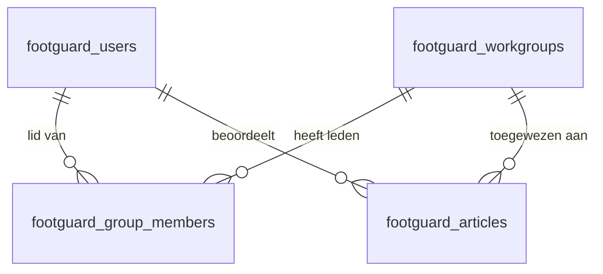

# FootGuard

## Inhoudsopgave

- [FootGuard](#footguard)
- [Opdrachtomschrijving](#opdrachtomschrijving)
- [Branches](#branches)
- [Ontwerp en design](#ontwerp-en-design)
- [Technische stack](#technische-stack)
- [Datamodel](#datamodel)
- [Pagina's](#paginas)
  - [Dashboard](#dashboard)
  - [Grading](#grading)
  - [Groups](#groups)
  - [Checklist](#checklist)
  - [Results](#results)
  - [Notifications](#notifications)
  - [Profile](#profile)
- [Gebruikershandleiding](#gebruikershandleiding)
- [Bijdragen aan het project](#bijdragen-aan-het-project)
  - [Conventions](#conventions)
- [Changelog](#changelog)
- [Teamleden](#teamleden)
- [Installatie](#installatie)
- [Licentie](#licentie)
- [Openstaande functionaliteit & aandachtspunten](#openstaande-functionaliteit--aandachtspunten)

## FootGuard

FootGuard is een webbased dashboard-tool voor de **International Working Group on the Diabetic Foot (IWGDF)**.  
Het helpt specialisten zoals artsen en onderzoekers bij het beoordelen van wetenschappelijke artikelen over diabetische voetproblematiek.

Op dit moment gebeurt het beoordelingsproces grotendeels via Excel, wat onoverzichtelijk en inefficiënt is. FootGuard brengt dit proces samen in één digitale omgeving waarin artikelen toegewezen, beoordeeld en opgevolgd kunnen worden binnen workgroups.

**Live versie:** [FootGuard](https://footguard-dev.netlify.app/)

## Opdrachtomschrijving

Het doel van deze sprint was het opzetten van een **release candidate** met basisfunctionaliteiten van de webapplicatie.  
De applicatie brengt artikelen, checklists en reviewers samen in een overzichtelijk dashboard en maakt het beoordelen efficiënter.

## Branches

- [Dev branch](https://github.com/fdnd-agency/footguard/tree/dev)
- [Main branch](https://github.com/fdnd-agency/footguard/tree/main)

**Workflow:**

- Feature branches worden gemaakt vanaf `dev`.
- Alleen volledig geteste features worden naar `dev` gemerged.
- `main` branch wordt alleen gebruikt voor release candidates.

## Ontwerp en design

- **Kleurenpallet:** gebaseerd op het IWGDF-logo, consistent in alle UI-elementen.
- **Typografie:** DM Sans, modern en goed leesbaar.
- **Navigatie:** Sidebar links, inklapbaar op kleinere schermen.
- **Hi-fi designs & UML:** Schetsen en diagrammen in [Figma](https://www.figma.com/design/FcenWarr4zCNYt1xSufqHv/Sprint-14-Footguard?node-id=16-2&p=f).

## Technische stack

- Frontend: Svelte / SvelteKit
- Styling: CSS + Styleguide.css
- Package manager: npm
- Version control: Git / GitHub
- Branching model: Feature branches via `dev` → merge na review
- Conventies: FDND Agency & [`CONTRIBUTING.md`](./CONTRIBUTING.md)

## Datamodel

FootGuard slaat data op in Directus. De belangrijkste collecties en hun relaties:


```mermaid
erDiagram
  footguard_users ||--o{ footguard_group_members : "lid van"
  footguard_workgroups ||--o{ footguard_group_members : "heeft leden"
  footguard_workgroups ||--o{ footguard_articles : "toegewezen aan"
  footguard_users ||--o{ footguard_articles : "beoordeelt"
```

- `footguard_users` — gebruikers (naam, email, role, institute, profession, photo)
- `footguard_workgroups` — workgroups (naam, status, condition label, afbeelding)
- `footguard_group_members` — koppelt gebruikers aan workgroups (role, membership status)
- `footguard_articles` — artikelen die aan een workgroup en reviewers zijn toegewezen

Volledig diagram: [`docs/database.md`](./docs/database.md).

## Pagina's

### Dashboard

- Overzicht van de status van onderzoeken en openstaande taken.
- Navigatie naar onafgemaakte checklists, compare grading pagina en persoonlijke statistieken.

### Grading

- Overzicht van artikelen toegewezen aan de gebruiker.
- Cards bevatten titel, auteur, publicatiejaar en status (Not Started, In Progress, Finished).
- Filteren op status en thema is mogelijk.

### Groups

- Groepspagina op `/groups` — hier beheer je workgroups en zie je wie erin zit.
- Data komt uit Directus (`footguard_workgroups`, `footguard_group_members` en `footguard_articles`), opgehaald op de server.

**Wat je ziet op de pagina**

- Een korte intro-banner bovenaan.
- Een "Guidelines"-filter (dropdown) en, als je admin bent, een knop om een nieuwe groep aan te maken.
- Een grid met groepskaarten. Elke kaart toont:
  - Groepsnaam, status, condition label en een afbeelding.
  - Een lijst met artikelen die aan de groep zijn gekoppeld.
  - Een formulier om een bestaande gebruiker toe te voegen via e-mailadres.
- Via de knop **Members** draai je de kaart om. Aan de achterkant zie je alle leden met naam, role en avatar.
- Super Admins kunnen niet verwijderd worden via de remove-knop.

**Wat je kunt doen (als gebruiker)**

- Klik **Members** op een kaart om de ledenlijst te bekijken, en **Back** om terug te gaan.
- Vul een e-mailadres in om iemand toe te voegen. Die persoon moet al een account hebben in FootGuard. Er wordt geen uitnodigingsmail verstuurd — de gebruiker wordt direct als lid toegevoegd.
- Verwijder een lid via de min-knop naast hun naam (behalve Super Admin).

**Wat je kunt doen (als admin)**

- Klik **Add Group** om een nieuwe groep aan te maken. Vul minimaal een groepsnaam in; condition label, status, thumbnail en leden zijn optioneel.
- Open het drie-puntjesmenu op een kaart om een groep te verwijderen (met bevestiging).
- Bewerkmodus voor groepen staat in het menu maar is nog niet volledig uitgewerkt.

**Als data niet laadt**

- Als Directus helemaal niet bereikbaar is, krijg je een foutpagina (500).
- Als alleen de artikelen van één groep niet laden, blijft de rest van de pagina werken — die groep toont dan gewoon geen artikelen.

**Hoe de pagina werkt (voor developers)**

Relevante bestanden: `src/routes/groups/+page.svelte`, `src/routes/groups/+page.server.js`, `src/lib/server/groups.js`, `src/lib/components/groups/GroupCard.svelte`, `src/lib/components/groups/GroupMemberCard.svelte`, `src/lib/components/groups/GroupInviteForm.svelte`, `src/lib/components/groups/CreateGroupModal.svelte`.

Server actions in `+page.server.js`:

- `?/addMember` — gebruiker toevoegen op basis van e-mail
- `?/remove` — lid verwijderen (soft delete via `membership_status: inactive`)
- `?/createGroup` — nieuwe groep aanmaken (alleen admin)
- `?/deleteGroup` — groep verwijderen (alleen admin)

Admin-rechten worden bepaald door de role van de ingelogde gebruiker (`admin` of `super_admin`). Het aanmaak-modal opent via `?create-new-group` in de url.

### Checklist

- PDF van artikel naast de checklist.
- Antwoorden en notities invullen.
- 25 vragen met voortgangscounter.

### Results / Compare Grading

- Overzicht van ingevulde checklist-antwoorden van 2 reviewers.
- Mogelijkheid om verschillen te vergelijken en definitieve beoordeling te bepalen.

### Notifications

- Lijst van meldingen zoals nieuwe ingeleverde checklists door collega’s of workgroup members.

### Login
- Loginpagina op /login.
- Gebruikers loggen in via een magic link die naar hun e-mailadres wordt verstuurd.
- Gebruikersgegevens worden opgehaald uit Directus (footguard_users).

**Wat je ziet op de pagina**
- Een invoerveld voor het e-mailadres.
- Een knop om een magic link aan te vragen.
- Een bevestigingsscherm nadat de aanvraag is verzonden.

**Hoe het werkt**
- De gebruiker voert een geldig e-mailadres in.
- Er wordt een tijdelijke magic link gegenereerd die 15 minuten geldig blijft.
- De link wordt verstuurd via Resend.
- Bij het openen van de link komt de gebruiker eerst op een bevestigingspagina.
- Na het klikken op Sign in to IWGDF wordt de sessie aangemaakt en wordt de gebruiker ingelogd.

**Beveiliging**
- Tokens worden gehasht opgeslagen in Directus.
- Een magic link kan slechts één keer gebruikt worden.
- Rate limiting voorkomt misbruik van het loginformulier.
- De oplossing is compatibel met Microsoft Safe Links doordat token-validatie pas gebeurt na een POST-request.

**Hoe de pagina werkt (voor developers)**
Relevante bestanden: src/routes/login/+page.svelte, src/routes/login/api/magic-link/+server.js, src/routes/login/magic-login/+page.server.js, src/routes/login/magic-login/+page.svelte, src/lib/server/email.js, src/hooks.server.ts.
### Profile


- Profielpagina op `/profile` voor de ingelogde gebruiker.
- Gegevens komen uit Directus (`footguard_users`), opgehaald op de server.

**Wat je ziet op de pagina**

- Bovenaan: profielfoto, naam en beroep.
- Daaronder "General Information" (de sectietitel in de UI): role, institution, profession en email.
- Onderaan een link naar Groups.
- Role kun je niet aanpassen — dit wordt beheerd door een admin.

**Profiel aanpassen (als gebruiker)**

- Ga naar Profile in de sidebar en klik **Edit Profile** rechtsboven.
- Je kunt dan naam, beroep, institution, email en profielfoto aanpassen. Role blijft alleen-lezen.
- Kies eventueel een nieuwe foto via **Change photo**.
- Klik **Save Changes** om op te slaan. Wijzigingen gaan via een POST naar `?/saveProfile` en je komt terug op `/profile` met een bevestigingsbanner.
- Klik **Cancel** om te stoppen zonder op te slaan.

**Als Directus niet bereikbaar is**

- De pagina blijft werken met gegevens uit de login-sessie.
- Er is geen aparte foutmelding.
- **Let op:** als Directus niet bereikbaar is en de sessiegegevens verouderd zijn, kan de pagina onjuiste gegevens tonen.

**Hoe de pagina werkt (voor developers)**

Relevante bestanden: `src/routes/profile/+page.svelte`, `src/routes/profile/+page.server.js`, `src/lib/components/profile/ProfileHero.svelte`, `src/lib/components/profile/ProfileInfo.svelte`, `src/lib/components/profile/EditActions.svelte`.

Als je een veld wilt toevoegen of wijzigen: pas het aan in `ProfileHero` of `ProfileInfo`, voeg het toe in `formFieldsFromUser()` (in `+page.svelte` en `+page.server.js`), en zorg dat `saveProfile` in `+page.server.js` het ook opslaat. Het veld moet ook bestaan in Directus.

Bewerkmodus gaat aan via `?edit` in de url (`/profile?edit`).


## Gebruikershandleiding

- Log in met je account.
- Ga naar **Grading** om toegewezen artikelen te bekijken.
- Klik op een artikel om de **Checklist** te openen.
- Vul de checklistvragen in en voeg eventueel notities toe.
- Gebruik **Dashboard** om voortgang te volgen en naar Results te navigeren.
- Bekijk **Notifications** voor updates van je workgroup.

## Bijdragen aan het project

### Conventions

Volg de technische conventies van [FDND Agency](https://docs.fdnd.nl/conventies.html):

- Git workflow
- Commits
- Pull requests
- Code conventions
- Design conventions

> Houd ook rekening met [`CONTRIBUTING.md`](./CONTRIBUTING.md) en [`HANDOVER.md`](./HANDOVER.md):

- Code style & conventions
- Commitregels
- Merge- en reviewproces
- Werkwijze projectboard
- Opbouw van user story’s
- Samenwerking

## Changelog

**Recente updates**

- **Groups:** groepen aanmaken (create modal met member picker en thumbnail upload), leden toevoegen/verwijderen, groep verwijderen met bevestiging, flip-kaarten met artikelen en ledenlijst.
- **Profile:** profiel bekijken en bewerken (naam, beroep, institution, email, profielfoto).
- Basisfunctionaliteiten: Dashboard, Grading, Checklist, Results, Notifications.
- Sidebar navigatie, kleurenschema, typografie en hi-fi design toegepast.
- Live versie beschikbaar op [FootGuard](https://footguard-dev.netlify.app/).

## Teamleden

- Razan Sagheer - Software Development - [GitHub](https://github.com/RazanSagheer)
- Yamen alsharabi - Frontend Developer - [Github](https://github.com/yamenAl)
- Kim Nikita Schijf – Frontend Developer – [GitHub](https://github.com/Kimnikitaschijf)
- Ravi Tjikhoeri – Frontend Developer – [GitHub](https://github.com/Ravirkt)
- Suleyman Huzeyfe Gokgul – Frontend Developer – [GitHub](https://github.com/SuleymanHG)

## Installatie

```bash
git clone https://github.com/fdnd-agency/footguard.git
cd footguard
npm install
npm run dev
```

## Licentie

This project is licensed under the terms of the [MIT license](./LICENSE).

## CI/CD Commands
- FootGuard maakt gebruik van GitHub Actions voor Continuous Integration.
- Bij iedere Pull Request naar dev worden automatisch controles uitgevoerd:

```bash
npm run build       # Build the project for production
npm run preview     # Preview the built project
npm run lint        # Run ESLint to check for code quality issues
npm run format      # Check if code is formatted using Prettier
npm run format:fix  # Automatically format the code using Prettier
npm run test        # Run tests (if available)
```

Alleen wanneer deze controles succesvol zijn kan code veilig worden gemerged naar de ontwikkelbranch

