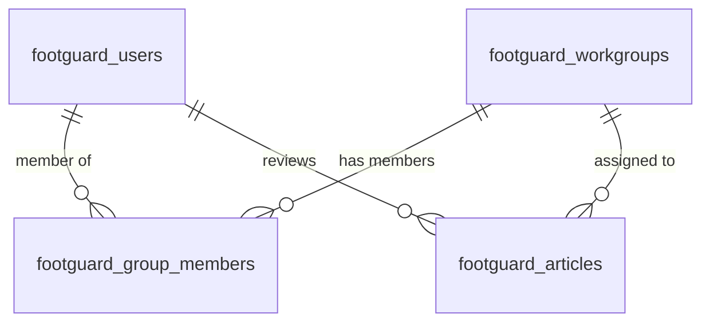

# FootGuard

## Table of Contents

**Overview**

- [FootGuard](#footguard)
- [Project Description](#project-description)
- [Branches](#branches)
- [Design](#design)
- [Tech Stack](#tech-stack)
- [Data Model](#data-model)

**Pages**

- [Pages](#pages)
  - [Dashboard](#dashboard)
  - [Grading](#grading)
  - [Groups](#groups)
  - [Checklist](#checklist)
  - [Results](#results)
  - [Notifications](#notifications)
  - [Profile](#profile)

**Project**

- [User Guide](#user-guide)
- [Contributing](#contributing)
  - [Conventions](#conventions)
- [Changelog](#changelog)
- [Team Members](#team-members)
- [Installation](#installation)
- [License](#license)
- [Open Features & Notes](#open-features--notes)

## FootGuard

FootGuard is a web-based dashboard tool for the **International Working Group on the Diabetic Foot (IWGDF)**.  
It helps specialists such as doctors and researchers evaluate scientific articles on diabetic foot conditions.

Currently, the review process is largely done via Excel, which is unorganised and inefficient. FootGuard brings this process together in a single digital environment where articles can be assigned, reviewed, and tracked within workgroups.


**Live version:** [FootGuard](https://footguard-dev.netlify.app/)

## Project Description

The goal of this sprint was to set up a **release candidate** with the core functionalities of the web application.  
The application brings articles, checklists, and reviewers together in a clear dashboard, making the review process more efficient.

## Branches

- [Dev branch](https://github.com/fdnd-agency/footguard/tree/dev)
- [Main branch](https://github.com/fdnd-agency/footguard/tree/main)

**Workflow:**

- Feature branches are created from `dev`.
- Only fully tested features are merged into `dev`.
- The `main` branch is only used for release candidates.

## Design

- **Color palette:** based on the IWGDF logo, consistent across all UI elements.
- **Typography:** DM Sans, modern and highly readable.
- **Navigation:** Sidebar on the left, collapsible on smaller screens.
- **Hi-fi designs & UML:** Sketches and diagrams in [Figma](https://www.figma.com/design/CNlARnfpaU0koXgKTTtxhM/Footguard-Stage?node-id=0-1&t=9Hs8vHhyd5kdKcZr-1).

## Tech Stack

- Frontend: Svelte / SvelteKit
- Styling: CSS + Styleguide.css
- Package manager: npm
- Version control: Git / GitHub
- Branching model: Feature branches via `dev` → merge after review
- Conventions: FDND Agency & [`CONTRIBUTING.md`](./CONTRIBUTING.md)

## Data Model

FootGuard stores data in Directus. The main collections and their relationships:


```mermaid
erDiagram
  footguard_users ||--o{ footguard_group_members : "member of"
  footguard_workgroups ||--o{ footguard_group_members : "has members"
  footguard_workgroups ||--o{ footguard_articles : "assigned to"
  footguard_users ||--o{ footguard_articles : "reviews"
```

- `footguard_users` — users (name, email, role, institute, profession, photo)
- `footguard_workgroups` — workgroups (name, status, condition label, image)
- `footguard_group_members` — links users to workgroups (role, membership status)
- `footguard_articles` — articles assigned to a workgroup and reviewers

Full diagram: [`docs/database.md`](./docs/database.md).

## Pages

### Dashboard

- Overview of the status of studies and outstanding tasks.
- Navigation to unfinished checklists, the compare grading page, and personal statistics.

### Grading

- Overview of articles assigned to the user.
- Cards contain title, author, publication year, and status (Not Started, In Progress, Finished).
- Filtering by status and theme is available.

### Groups

- Groups page at `/groups` — manage workgroups and view their members.
- Data comes from Directus (`footguard_workgroups`, `footguard_group_members`, and `footguard_articles`), fetched on the server.
  Group page [Datamodel](https://github.com/fdnd-agency/footguard/issues/303).

- Mobile:<br>
<br>
<hr>

- Desktop:


**What you see on the page**

- A short intro banner at the top.
- A "Guidelines" filter (dropdown) and, if you are an admin, a button to create a new group.
- A grid of group cards. Each card shows:
  - Group name, status, condition label, and an image.
  - A list of articles linked to the group.
  - A form to add an existing user via email address.
- Clicking the **Members** button flips the card. On the back you see all members with their name, role, and avatar.
- Super Admins cannot be removed via the remove button.

**What you can do (as a user)**

- Click **Members** on a card to view the member list, and **Back** to return.
- Enter an email address to add someone. That person must already have an account in FootGuard. No invitation email is sent — the user is added as a member directly.
- Remove a member via the minus button next to their name (except Super Admin).

**What you can do (as an admin)**

- Click **Add Group** to create a new group. At minimum, enter a group name; condition label, status, thumbnail, and members are optional.
- Open the three-dot menu on a card to delete a group (with confirmation).
- Edit mode for groups is in the menu but has not been fully implemented yet.

**If data fails to load**

- If Directus is completely unreachable, you will get an error page (500).
- If only the articles for one group fail to load, the rest of the page continues to work — that group will simply show no articles.

**How the page works (for developers)**

Relevant files: `src/routes/groups/+page.svelte`, `src/routes/groups/+page.server.js`, `src/lib/server/groups.js`, `src/lib/components/groups/GroupCard.svelte`, `src/lib/components/groups/GroupMemberCard.svelte`, `src/lib/components/groups/GroupInviteForm.svelte`, `src/lib/components/groups/CreateGroupModal.svelte`.

Server actions in `+page.server.js`:

- `?/addMember` — add a user by email
- `?/remove` — remove a member (soft delete via `membership_status: inactive`)
- `?/createGroup` — create a new group (admin only)
- `?/deleteGroup` — delete a group (admin only)

Admin permissions are determined by the role of the logged-in user (`admin` or `super_admin`). The creation modal opens via `?create-new-group` in the URL.

### Checklist

- PDF of the article displayed alongside the checklist.
- Fill in answers and notes.
- 25 questions with a progress counter.

### Results / Compare Grading

- Overview of completed checklist answers from 2 reviewers.
- Ability to compare differences and determine the final assessment.

### Notifications

- List of notifications such as newly submitted checklists by colleagues or workgroup members.

### Login

- Login page at `/login`.
- Users log in via a magic link sent to their email address.
- User data is retrieved from Directus (`footguard_users`).
- Mobile:<br>

<br>
<hr>

- Desktop:<br>


**What you see on the page**

- An input field for the email address.
- A button to request a magic link.
- A confirmation screen after the request has been submitted.

**How it works**

- The user enters a valid email address.
- A temporary magic link is generated that remains valid for 15 minutes.
- The link is sent via Resend.
- Opening the link takes the user to a confirmation page first.
- After clicking Sign in to IWGDF, the session is created and the user is logged in.

**Security**

- Tokens are stored hashed in Directus.
- A magic link can only be used once.
- Rate limiting prevents abuse of the login form.
- The solution is compatible with Microsoft Safe Links because token validation only occurs after a POST request.

**How the page works (for developers)**

Relevant files: `src/routes/login/+page.svelte`, `src/routes/login/api/magic-link/+server.js`, `src/routes/login/magic-login/+page.server.js`, `src/routes/login/magic-login/+page.svelte`, `src/lib/server/email.js`, `src/hooks.server.ts`.

### Profile

- Profile page at `/profile` for the logged-in user.
- Data comes from Directus (`footguard_users`), fetched on the server.
- Mobile:<br>
<br>
<hr>

- Desktop:<br>


**What you see on the page**

- At the top: profile photo, name, and profession.
- Below that, "General Information" (the section title in the UI): role, institution, profession, and email.
- At the bottom, a link to Groups.
- Role cannot be changed — this is managed by an admin.

**Editing your profile (as a user)**

- Go to Profile in the sidebar and click **Edit Profile** in the top right.
- You can then change your name, profession, institution, email, and profile photo. Role remains read-only.
- Optionally choose a new photo via **Change photo**.
- Click **Save Changes** to save. Changes are submitted via a POST to `?/saveProfile` and you are returned to `/profile` with a confirmation banner.
- Click **Cancel** to stop without saving.

**If Directus is unreachable**

- The page continues to work using data from the login session.
- There is no separate error message.
- **Note:** if Directus is unreachable and the session data is outdated, the page may display incorrect information.

**How the page works (for developers)**

Relevant files: `src/routes/profile/+page.svelte`, `src/routes/profile/+page.server.js`, `src/lib/components/profile/ProfileHero.svelte`, `src/lib/components/profile/ProfileInfo.svelte`, `src/lib/components/profile/EditActions.svelte`.

To add or change a field: update it in `ProfileHero` or `ProfileInfo`, add it to `formFieldsFromUser()` (in both `+page.svelte` and `+page.server.js`), and make sure `saveProfile` in `+page.server.js` also saves it. The field must also exist in Directus.

Edit mode is toggled via `?edit` in the URL (`/profile?edit`).

## User Guide

- Log in with your account.
- Go to **Grading** to view your assigned articles.
- Click on an article to open the **Checklist**.
- Fill in the checklist questions and optionally add notes.
- Use **Dashboard** to track progress and navigate to Results.
- Check **Notifications** for updates from your workgroup.

## Contributing

### Conventions

Follow the technical conventions of [FDND Agency](https://docs.fdnd.nl/conventies.html):

- Git workflow
- Commits
- Pull requests
- Code conventions
- Design conventions

> Also refer to [`CONTRIBUTING.md`](./CONTRIBUTING.md) and [`HANDOVER.md`](./HANDOVER.md):

- Code style & conventions
- Commit rules
- Merge and review process
- Project board workflow
- Structure of user stories
- Collaboration

## Changelog

**Recent updates**

- **Groups:** create groups (create modal with member picker and thumbnail upload), add/remove members, delete group with confirmation, flip cards with articles and member list.
- **Profile:** view and edit profile (name, profession, institution, email, profile photo).
- Core features: Dashboard, Grading, Checklist, Results, Notifications.
- Sidebar navigation, color scheme, typography, and hi-fi design applied.
- A design system has been made for next groups to easily acces the webpages style.
- Live version available at [FootGuard](https://footguard-dev.netlify.app/).

## Team Members

- Razan Sagheer - Software Development - [GitHub](https://github.com/RazanSagheer)
- Yamen Alsharabi - Frontend Developer - [GitHub](https://github.com/yamenAl)
- Mees Bulsing - UX/UI Designer - [GitHub](https://github.com/meesbulsing)
- Kim Nikita Schijf – Frontend Developer – [GitHub](https://github.com/Kimnikitaschijf)
- Ravi Tjikhoeri – Frontend Developer – [GitHub](https://github.com/Ravirkt)
- Suleyman Huzeyfe Gokgul – Frontend Developer – [GitHub](https://github.com/SuleymanHG)

## Installation

```bash
git clone https://github.com/fdnd-agency/footguard.git
cd footguard
npm install
npm run dev
```

## License

This project is licensed under the terms of the [MIT license](./LICENSE).

## CI/CD Commands

FootGuard uses GitHub Actions for Continuous Integration.  
On every Pull Request to `dev`, checks are run automatically:

```bash
npm run build       # Build the project for production
npm run preview     # Preview the built project
npm run lint        # Run ESLint to check for code quality issues
npm run format      # Check if code is formatted using Prettier
npm run format:fix  # Automatically format the code using Prettier
npm run test        # Run tests (if available)
```

Only when these checks pass can code safely be merged into the development branch.
